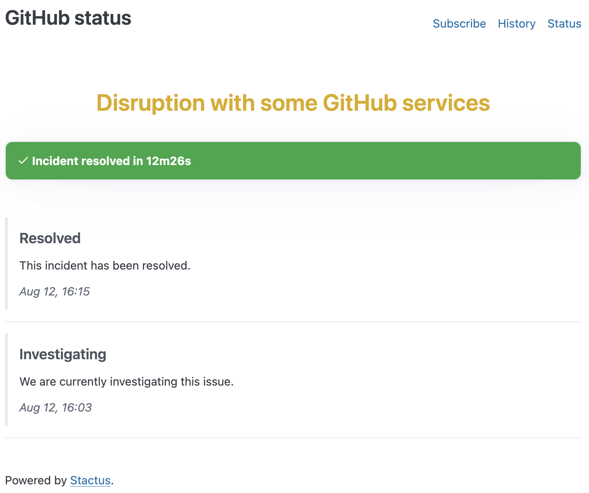

# Stactus

Your modern static status page generator.

Are you familiar with [Jekyll](https://jekyllrb.com/), [Hugo](https://gohugo.io/), [mkdocs](https://www.mkdocs.org/) or similar generators? if yes, you already know how to use stactus.

With Stactus you can create beautiful status page with simple YAMLs in matter of seconds, the generated HTMLs can be uploaded to places like [Github pages](https://pages.github.com/) or serve them with a simple Nginx.

Creating and updating and incident is as simple as this:

```yaml
version: incident/v1
id: fnj6l879tbtw
name: Disruption with some GitHub services
impact: minor
timeline:
  - ts: "2024-08-12 14:03:13"
    description: We are currently investigating this issue.
    investigating: true
  - ts: "2024-08-12 14:15:39"
    description: This incident has been resolved.
    resolved: true
```

And will render this:



## Features

- Simple architecture (single binary).
- Simple and easy to use APIs based on YAML.
- No need for a backend, it's just HTML what it generates.
- Easy to deploy and operate (e.g: Github pages).
- Based on static configuration (e.g: YAML Files on a git repo).
- Customizable with built-in themes.
- Extendable with custom themes that can live on the same repo as the incidents.
- Markdown support on incident details (is optional, not required).
- Prometheus metrics (yes! they are also part of the static generation).
- Able to subscribe to updates with Atom feed (and/or Prometheus metrics).
- Atlassian status page migrator.

## Why

The purpose of a static page is to be a central place where clients can check the current status of a service. This means that a static page is not a place to know the availability, latency or service metrics.

**It's all about comms.**

A status page is a communication point, a simple file with text is enough, you don't need an over complicated backend that checks latency and makes pings every N minutes.

**Low level metrics are for the company, communication and updates are for the clients.**

Moreover, using the simplest possible solution makes it portable (out from your infrastructure), less security problems and less to maintain.

## Getting started

You can check the Stactus [showcase][stactus-showcase], or download yourself and run it:

```bash
git clone https://github.com/slok/stactus-showcase /tmp/stactus-showcase
stactus serve -i /tmp/stactus-showcase/showcases/github/stactus.yaml
```

### Example

- [Example with Github actions deploying to status pages](https://github.com/slok/stactus-showcase).

## Concepts

These are the concepts that need to be known before using stactus:

- System: A system is a part of your project/business/infrastructure that you want to set an status (e.g for github status: `Pull Requests`, `Packages`, `Webhooks`...).
- Incident: A downtime period of time in a system or multiple systems where you want to communicate updates (e.g: `Incident with Sporadic Timeouts in Codespaces`).
- Incident Timeline: The list of updates in time for an incident
- Incident timeline update: The information in a specific point in time for an incident timeline, it can be in multiple states like `resolved`, `investigating`, `update`
- Incident open/closed: If an incident has not been resolved it will be open, closed if has been resolved.

In a few words: `System -> Incident -> Timeline -> Update`

## YAML static API

The YAML API of stactus is based in two parts. One file with the general settings of the status page itself (theme, URL...). And a group of  multiple incidents files.

The working flow is create a new incident YAML file every time there is an new incident.

### General settings V1

You can check the [API here](./pkg/api/v1/stactusv1.go)

A simple example mimicking Github status would be this:

```yaml
version: stactus/v1
name: GitHub
url: https://www.githubstatus.com
systems:
  - id: git-operations
    name: Git Operations
    description: Performance of git clones, pulls, pushes, and associated operations
  - id: webhooks
    name: Webhooks
    description: Real time HTTP callbacks of user-generated and system events
```

#### Themes

Stactus comes with a default theme (`simple`), you can override the `simple` theme  templates using the settings:

```yaml
version: stactus/v1
name: GitHub
# ...
theme:
  simple:
    themePath: /disk/path/to/my/templates
```

To know how to customize these templates check the section [Theme customization](#themes-and-customization)

### Incident V1

You can check the [API here](./pkg/api/v1/incident.go)

```yaml
version: incident/v1
id: 20240913-0001
name: Processing delays to some Issues, Pull Requests and Webhooks
impact: critical
systems: ["system1"]
timeline:
  - ts: 2024/09/13 05:42
    investigating: true
    description: We are investigating reports of degraded performance for Issues, Pull Requests and Webhooks

  - ts: 2024/09/13 05:59
    investigating: true
    description: Actions is experiencing degraded performance. We are continuing to investigate.  

  - ts: 2024/09/13 06:23
    description: |
      We've applied a mitigation to fix the issues being experienced
      in some cases with delays to webhook deliveries, and the delayed reporting
      of the outcome of some running Actions jobs. We are monitoring for full recovery.

  - ts: 2024/09/13 06:49
    description: We are seeing improvements in telemetry and are monitoring the delivery of delayed Webhooks and Actions job statuses.
  
  - ts: 2024/09/13 07:13
    resolved: true
    description: This incident has been resolved.
```

As it can be seen, an incident is attached to one or multiple systems, the key part is the timeline. A timeline update needs mainly 3 things, the timestamp, the description and the status of the update.

#### Description

The description is a free text, if you need to provide format, it supports Markdown (this can be handy for a bigger resolution description).

#### Status

A timeline needs a start and an end, the most important one is the update that marks the timeline as resolved (`resolved: true`), but you can  use `investigating: true` to give context that there is an investigation ongoing, if none of these are used, the status will be set as a regular timeline `update`.

#### Timestamp

The formats supported by stactus are multiple, and in case there is no TZ defined, it sets as UTC. The supported formats:

- `2024-09-13 05:59`: Human readable pretty TS.
- `2024-09-13T05:42:00Z`: Regular RFC3339.
- `2024-09-13T05:59:00.000000000Z`: Regular RFC3339 with nanoseconds.
- `+17m`: If there is a previous update with a set TS, then you can use this format to add relative seconds, minutes and hours in this friendly format to the previous TS.
- `05:59`: If there is a previous update with a set TS, then you can use this format to set the hour relative to the same day from the previous TS.

Example of a valid timeline:

```yaml
version: incident/v1
#...
timeline:
  - ts: 2024/09/13 05:42
    description: Update 1
  - ts: +30m
    description: Update 2
  - ts: +1h
    description: Update 3
  - ts: +2h
    description: Update 4
  - ts: +15m
    description: Update 5
  - ts: 19:00
    description: Update 6
    resolved: true
```

## Subscriptions

Although it's an static page, your users can subscribe to updates in multiple ways:

### Atom

You can check the RSS in `{STATUS_PAGE_URL}/history-feed.atom`

[Real example of the showcase](https://slok.github.io/stactus-showcase/simple/github/history-feed.atom).

### Slack

You can use Slack with Atom RSS by using this Slack command:

```plain
/feed subscribe {STATUS_PAGE_URL}/history-feed.atom
```

### Prometheus metrics

Stactus generates multiple Prometheus metrics where users can discover and ingest so they can trigger alerts or notifications. Use this URL `{STATUS_PAGE_URL}/metrics`.

The provided metrics are:

- The general status.
- The specific status for each of the systems (Tells if there is an incident ongoing and the impact).
- The MTTR.

Real example of the showcase:

```bash
$ curl -s https://slok.github.io/stactus-showcase/simple/github/metrics

# HELP stactus_all_systems_status Tells if all systems are operational or not.
# TYPE stactus_all_systems_status gauge
stactus_all_systems_status{status_ok="true",status_page="GitHub"} 1
# HELP stactus_incident_mttr_seconds The MTTR based on all the incident history.
# TYPE stactus_incident_mttr_seconds gauge
stactus_incident_mttr_seconds{status_page="GitHub"} 6196.028571428
# HELP stactus_system_status Tells Systems are operational or not.
# TYPE stactus_system_status gauge
stactus_system_status{id="0l2p9nhqnxpd",impact="none",name="Visit www.githubstatus.com for more information",status_ok="true",status_page="GitHub"} 1
stactus_system_status{id="4230lsnqdsld",impact="none",name="Webhooks",status_ok="true",status_page="GitHub"} 1
stactus_system_status{id="8l4ygp009s5s",impact="none",name="Git Operations",status_ok="true",status_page="GitHub"} 1
stactus_system_status{id="br0l2tvcx85d",impact="none",name="Actions",status_ok="true",status_page="GitHub"} 1
stactus_system_status{id="brv1bkgrwx7q",impact="none",name="API Requests",status_ok="true",status_page="GitHub"} 1
stactus_system_status{id="h2ftsgbw7kmk",impact="none",name="Codespaces",status_ok="true",status_page="GitHub"} 1
stactus_system_status{id="hhtssxt0f5v2",impact="none",name="Pull Requests",status_ok="true",status_page="GitHub"} 1
stactus_system_status{id="kr09ddfgbfsf",impact="none",name="Issues",status_ok="true",status_page="GitHub"} 1
stactus_system_status{id="pjmpxvq2cmr2",impact="none",name="Copilot",status_ok="true",status_page="GitHub"} 1
stactus_system_status{id="st3j38cctv9l",impact="none",name="Packages",status_ok="true",status_page="GitHub"} 1
stactus_system_status{id="vg70hn9s2tyj",impact="none",name="Pages",status_ok="true",status_page="GitHub"} 1
```

You can ingest these public metrics in your prometheus and alert whent he changes status.

Example of Prometheus ingestion configuration to the showcase:

```yaml
scrape_configs:
  - job_name: prometheus
    static_configs:
      - targets: ["localhost:9090"]

  - job_name: test
    metrics_path: /stactus-showcase/simple/github/metrics
    scheme: https
    static_configs:
      - targets: ["slok.github.io"]
        labels:
          example: 'test'
```

## Themes and customization

There are two concepts for customization:

- Theme: The information the templates will receive and the templates that are going to be rendered with this information.
- Template: A [go HTML template](https://pkg.go.dev/html/template) (It supports [sprig extensions](https://masterminds.github.io/sprig/)) that the theme will render.

This means that different themes can have different kind of information passed to the templates and different template rendering.

for now we only support customizing templates (**not themes**). Let's check the available themes:

### Simple

#### Features

- Default theme
- Templates can be customized.
- Independent incident detail page.
- Pagination for incident history.
- Ongoing incidents on index.

#### Variable and templates

 Use the [base templates](./internal/storage/html/themes/simple/) to understand the templates and the information that the templates will have available. The required template names are these:

- Index page: `page_index`
- Incidents list page (History):  `page_history`
- Incident details: `page_ir`

## Migrate from Atlassian status page

Stactus has support to migrate Atlassian status page (through the exposed API) into Stactus YAML files, the [Stactus showcase][stactus-showcase] is a migration of these. Example:

```bash
stactus migrate status-page --status-page-url https://www.githubstatus.com/ -o /tmp/stactus-gh
stactus serve -i  /tmp/stactus-gh/stactus.yaml
```

[stactus-showcase]: https://github.com/slok/stactus-showcase
